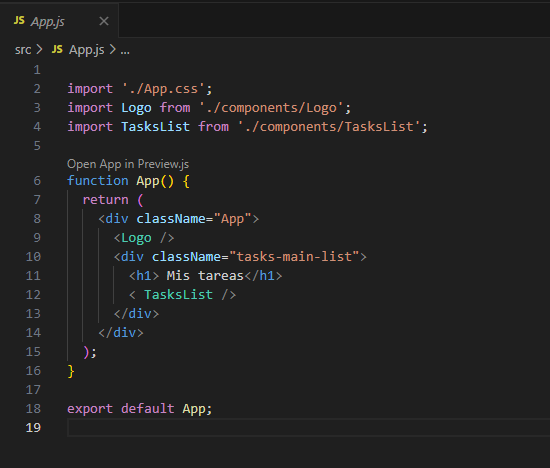
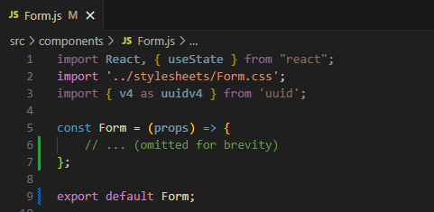
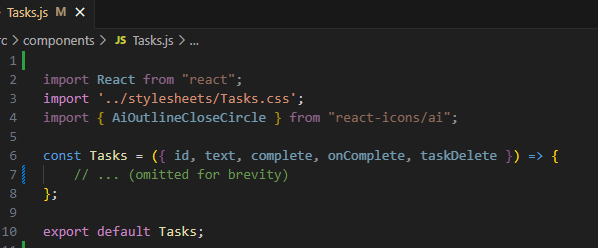
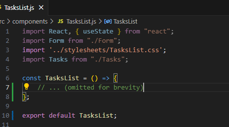
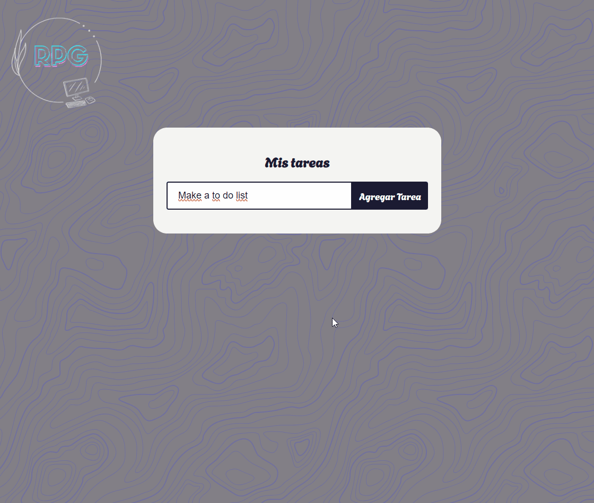

# To do list made by [Raquel Peña](https://www.linkedin.com/in/raquel-pe-go/) with React

This is a simple task manager application built with React. The application is organized into components for better maintainability and modularity. Below is an overview of the project structure and key features.

## Project Structure

### 1. App Component (App.js)

The App component serves as the main entry point for the application. It includes two child components: **Logo** and **TasksList**.

 
  
 

### 2. Form Component (Form.js)

The **Form** component handles task input and submission. It uses React hooks for state management and generates unique task IDs using the **uuid** library.

 
  
 

### 3. Tasks Component (Tasks.js)

The **Tasks** component represents an individual task and manages interactions related to that specific task. It allows users to mark the task as complete or delete it.

 
  
 

### 4. TasksList Component (TasksList.js)

The **TaskList** component oversees the entire list of tasks. It provides the capability to add new tasks to the list through the **Form** component. Additionally, it enables the deletion of tasks and marking specific tasks as complete.

 
  
 

### 5. CSS Stylesheets (stylesheets)

The application utilizes separate CSS stylesheets for each component to maintain a clean and organized styling structure.

## Key Features

### 1. Task Management

- Users can add tasks through the Form component.
- Tasks are displayed in the TasksList component.
- Individual tasks can be marked as complete or deleted.

### 2. Responsive Design

- The application adapts to different screen sizes using media queries.
- The button styling adjusts for better user experience on smaller screens.

### 3. Stylish Gradients

- Task items have stylish color gradients based on their position in the list.
- Gradients enhance the visual appeal of the application.

## Demo

 
  
 

## Usage

1. Clone the repository.
2. Install dependencies with npm install.
3. Run the application with npm start.

**Feel free to explore, modify, and use this code as a foundation for your own task management applications. Happy coding!**
